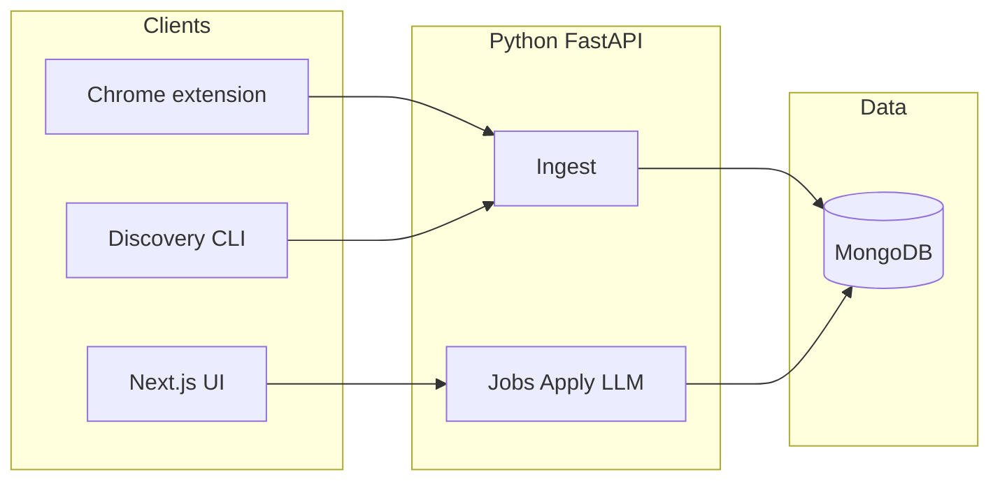

# Job Assistant

Local-first toolkit to **discover jobs**, **tailor application documents** (resume + cover letter), **check ATS-oriented basics**, and **track applications**.

Stack: **Next.js** (UI) · **Python / FastAPI** (API, LLM, Google Docs) · **MongoDB** (data).

A **Chrome extension** captures jobs from LinkedIn (user-initiated); **Python discovery** pulls listings from APIs, RSS, and public ATS boards.

> **Disclaimer:** Respect each site’s Terms of Service and robots/API rules. LinkedIn is best handled with **user-initiated** capture in the browser (extension) rather than unattended server scraping.

---

## Repository structure

```text
job-assistant/
├── apps/web/                 # Next.js (App Router) — UI only
├── services/api/             # FastAPI — HTTP API, DB, LLM, future Google OAuth
├── extensions/linkedin/      # Chrome MV3 — capture jobs, call ingest, deep-link to web
├── docker-compose.yml        # Local MongoDB for development
├── .gitignore
└── README.md
```

---

## Folder structure (for other developers)

This repo is a **small monorepo**: the browser, the web UI, and the API are separate packages so each can be developed and deployed independently later. **MongoDB is the system of record**; the Next.js app should not connect to Mongo directly—only the Python API should.

### `apps/web/` — frontend (Next.js)

| Path | What goes here |
|------|----------------|
| `app/` | App Router: `layout.tsx`, `page.tsx`, future routes like `jobs/[jobId]/apply/page.tsx` |
| `app/globals.css` | Global styles |
| `next.config.ts` | Next.js config |
| `package.json` | Node dependencies and scripts (`dev`, `build`) |
| `.env.example` | Copy to `.env.local`; **`NEXT_PUBLIC_API_URL`** points at FastAPI (e.g. `http://localhost:8000`) |

**Convention:** Server Components may call the API via `fetch` to the Python base URL. Do not put secrets that must stay server-only in `NEXT_PUBLIC_*` vars (those are exposed to the browser).

### `services/api/` — backend (FastAPI + MongoDB)

| Path | What goes here |
|------|----------------|
| `main.py` | FastAPI app entry: routes, CORS, lifespan (future: DB client) |
| `requirements.txt` | Python dependencies (add Motor, OpenAI SDK, etc. as features land) |
| `.env.example` | Copy to `.env`: `MONGODB_URI`, `OPENAI_API_KEY`, `INGEST_SECRET`, Google OAuth vars |
| `discovery/` | **Discovery connectors** (RSS, public ATS JSON, aggregators) and optional CLI entrypoint |

**Convention:** New REST endpoints live in `main.py` at first; split into `routers/` (e.g. `ingest.py`, `jobs.py`) when the file grows. Extension and discovery scripts authenticate with **`Authorization: Bearer <INGEST_SECRET>`** on ingest routes.

### `extensions/linkedin/` — Chrome extension (Manifest V3)

| File | What goes here |
|------|----------------|
| `manifest.json` | Extension id, permissions, `host_permissions` for LinkedIn + local API |
| `popup.html` / `popup.js` | Settings UI (API URL, ingest secret, web app URL) and actions |
| `README.md` | How to load unpacked in Chrome |

**Planned additions:** `content.js` (or `content/` build) injected on `linkedin.com/jobs/*` to read the job DOM and send structured JSON to `POST /ingest/job`. Keep LinkedIn-specific selectors and messaging isolated here—not in the Python service.

### Repo root

| File | Purpose |
|------|---------|
| `docker-compose.yml` | One-command **MongoDB** for local dev (`docker compose up -d`) |
| `.gitignore` | Ignores `node_modules`, `.venv`, `.env`, `.next`, etc. |

### How the pieces talk to each other

```text
Chrome extension  --HTTP-->  FastAPI (services/api)  --Motor-->  MongoDB
Next.js (apps/web) --HTTP-->  FastAPI (services/api)
```

- **Extension → API:** ingest captured jobs (Bearer token).
- **Web → API:** CRUD jobs, applications, “generate resume” actions (future: session or API key).
- **Discovery (Python):** same ingest API as the extension so all sources share one inbox and dedupe logic.

### Where to add a new feature (quick map)

| You are building… | Start in… |
|-------------------|-----------|
| New screen or URL in the product | `apps/web/app/…` |
| New HTTP endpoint or business logic | `services/api/` (new router or `main.py`) |
| Pull jobs from a new site (API/RSS) | `services/api/discovery/` |
| LinkedIn DOM capture or UX | `extensions/linkedin/` |

---

## Problem it solves

- **Less copy/paste:** capture a job from the page you’re already viewing.
- **Faster applications:** one flow from job → tailored resume + cover letter.
- **Better consistency:** structured resume data + templates + keyword/ATS checks.
- **No lost applications:** pipeline statuses and notes per job.

---

## How it works (high level)

1. **Browser extension** (Manifest V3): on a supported job page (e.g. LinkedIn job detail), click **Send to Job Assistant**. It reads visible page content and **POSTs to the Python API** (`/ingest/job`).
2. The extension opens the **Next.js** app (deep link), e.g. `/jobs/{jobId}/apply`, where you:
   - parse the JD (skills/requirements),
   - generate a **tailored resume** and **cover letter** (OpenAI via Python),
   - run **ATS-style checks** (Python heuristics + plain-text preview),
   - optionally **create/update Google Docs** in your Drive (OAuth in Python),
   - set **application status** and notes (stored in **MongoDB**).
3. **Discovery** (optional): Python CLI or scheduled job fetches jobs from **aggregator APIs**, **RSS**, or **public ATS JSON** into the same inbox.



---

## Tech stack

| Area | Choice |
|------|--------|
| **Frontend** | **Next.js** + **TypeScript** (App Router) |
| **Backend** | **Python 3.11+** + **FastAPI** |
| **Database** | **MongoDB** (Motor async driver, Pydantic models) |
| **LLM** | **OpenAI API** — JD parsing, resume tailoring, cover letters |
| **Auth (ingest)** | Long random **ingest token** (extension + discovery send `Authorization: Bearer …`) |
| **Google Docs** | **Google OAuth** + **Drive API** + **Docs API** (implemented in Python) |
| **Documents** | Structured JSON in MongoDB; sync to Google Docs; optional DOCX later |
| **Extension** | Chrome **Manifest V3** — `fetch` to Python API (CORS + local URL in dev) |
| **Discovery** | Python (`httpx`, `feedparser`, etc.); optional local Playwright for edge sites |

---

## Features (target)

- **Job inbox** with dedupe (URL / external id / title+company hash).
- **Apply screen** per job: tailored resume, cover letter, ATS report, exports.
- **Application tracker**: statuses (e.g. Saved → Applied → Phone → Onsite → Offer/Rejected), dates, notes.
- **Skill fit**: JD keyword overlap vs your master profile; optional self-ratings.
- **Google Docs**: create or update native Docs per job (resume + cover letter).
- **Discovery**: pluggable Python connectors for non-LinkedIn sources.

---

## Configuration (env vars — illustrative)

**Python** (`services/api/.env` — copy from `.env.example`):

```bash
MONGODB_URI=mongodb://localhost:27017/jobassistant
OPENAI_API_KEY=sk-...
INGEST_SECRET=...

# Google OAuth (Docs/Drive) — redirect URI must match Google Cloud Console
GOOGLE_CLIENT_ID=...
GOOGLE_CLIENT_SECRET=...
GOOGLE_REDIRECT_URI=http://localhost:8000/auth/google/callback
```

**Next.js** (`apps/web/.env.local`):

```bash
NEXT_PUBLIC_API_URL=http://localhost:8000
```

**Google Cloud setup (typically no charge for personal API usage within quotas):**

1. Create a project in Google Cloud Console.
2. Enable **Google Drive API** and **Google Docs API**.
3. Configure **OAuth consent** (External / Testing is fine for personal use).
4. Create **OAuth Client ID** (Web application) with the redirect URI above.

---

## Quick start (step by step)

This section is for anyone who wants to **run the app on their own computer** without assuming prior backend experience.

### What to install first

Install these from their official websites if you do not already have them:

| Tool | Why you need it |
|------|-----------------|
| [**Node.js** (LTS)](https://nodejs.org/) | Runs the website (`apps/web`). |
| [**Python** 3.11+](https://www.python.org/downloads/) | Runs the API (`services/api`). |
| [**MongoDB**](https://www.mongodb.com/try/download/community) **or** [**Docker Desktop**](https://www.docker.com/products/docker-desktop/) | Stores jobs and notes. With Docker you only run a container; no separate Mongo install. |
| [**Google Chrome**](https://www.google.com/chrome/) | For the LinkedIn extension. |
| [**OpenAI API key**](https://platform.openai.com/) (optional) | For “Generate resume / cover letter / ATS” on the apply page. |

On **Windows**, use **PowerShell** or **Command Prompt** instead of Terminal where it says “terminal” below. On **Mac/Linux**, use the **Terminal** app.

### 1. Open a terminal in the project folder

The folder should be named `job-assistant` and contain `apps`, `services`, and `extensions`.

### 2. Start MongoDB (database)

**Option A — Docker (same on Mac, Windows, Linux)**  
In the **project root** (where `docker-compose.yml` is):

```bash
docker compose up -d
```

**Option B — MongoDB installed on the machine**  
Start MongoDB the way you normally do (e.g. Windows Service, `brew services`, etc.). The default in `.env` is `mongodb://localhost:27017/jobassistant`.

### 3. Set up and run the API (backend)

Open a terminal:

```bash
cd services/api
python3 -m venv .venv
```

Activate the virtual environment:

- **Mac / Linux:** `source .venv/bin/activate`
- **Windows (cmd):** `.venv\Scripts\activate.bat`
- **Windows (PowerShell):** `.venv\Scripts\Activate.ps1`

Then:

```bash
pip install -r requirements.txt
```

Create your config file: copy `.env.example` to `.env` (same folder). Edit `.env` in any text editor:

- **`INGEST_SECRET`** — choose any long random string for personal use (e.g. `jobassistant-local-dev-ingest`). You will paste the **same value** into the Chrome extension.
- **`OPENAI_API_KEY`** — your `sk-...` key if you want AI-generated documents. You can leave it blank until you need that feature.
- **`MONGODB_URI`** — leave as default unless you use a non-standard Mongo setup.

Start the API (**leave this terminal open**):

```bash
uvicorn main:app --reload --host 127.0.0.1 --port 8000
```

**Check:** in a browser open [http://127.0.0.1:8000/health](http://127.0.0.1:8000/health). You should see `{"status":"ok"}`.

### 4. Set up and run the website (frontend)

Open a **second** terminal:

```bash
cd apps/web
npm install
```

Copy `apps/web/.env.example` to `apps/web/.env.local`. It should contain:

```bash
NEXT_PUBLIC_API_URL=http://localhost:8000
```

Start the site (**leave this terminal open**):

```bash
npm run dev -- --hostname 127.0.0.1 --port 3000
```

**Check:** open [http://127.0.0.1:3000](http://127.0.0.1:3000). You should see the job inbox.

### 5. Load the Chrome extension

1. In Chrome, go to `chrome://extensions`.
2. Turn **Developer mode** **ON** (top right).
3. Click **Load unpacked** and select the folder **`extensions/linkedin`** inside this repo (the folder that contains `manifest.json`).
4. Click the **Job Assistant** icon → enter:
   - **API base URL:** `http://localhost:8000`
   - **Web app URL:** `http://localhost:3000`
   - **Ingest secret:** exactly the same string as **`INGEST_SECRET`** in `services/api/.env`
5. Click **Save settings**.

### 6. Normal use

1. Start **MongoDB** (if not using Docker, ensure the service is running).
2. Start the **API** (step 3) and the **website** (step 4).
3. On LinkedIn, open a **full job posting** (with the description visible).
4. Open the extension → **Send current LinkedIn job** → a tab should open on the apply page.
5. On the apply page, paste your **profile / master resume** and click **Generate** if you configured OpenAI.

### 7. If something goes wrong

| Symptom | What to try |
|--------|-------------|
| “Cannot connect” / inbox error | API terminal running? Visit `/health`. |
| Website shows a weird `Cannot find module './…js'` error | Stop the site, run `rm -rf apps/web/.next`, then `npm run dev` again. |
| Port already in use (`EADDRINUSE`) | Close the other program using port **3000** or **8000**, or pick another port (advanced). |
| Extension says API error | Same **ingest secret** in extension and `.env`? API running? |
| AI button says OpenAI not configured | Set `OPENAI_API_KEY` in `services/api/.env` and **restart** the API. |

**One-command helper (Mac/Linux):** if Mongo is already on `localhost:27017`, from the repo root you can run `scripts/dev-local.sh` to start API + web together (see script for details).

---

## Local development

1. **MongoDB:** from repo root, `docker compose up -d` (or use a local install).
2. **API:** `cd services/api && python -m venv .venv && source .venv/bin/activate && pip install -r requirements.txt && uvicorn main:app --reload --port 8000`
3. **Web:** `cd apps/web && pnpm install && pnpm dev` (or `npm install && npm run dev`).
4. **Extension:** Chrome → Extensions → Load unpacked → select `extensions/linkedin`.

Configure **CORS** on FastAPI to allow `http://localhost:3000` for browser requests from the Next.js app (already enabled in the starter `main.py`).

---

## Security notes

- Never commit `.env` files or real API keys.
- The **ingest token** gates writes from the extension/discovery; rotate if leaked.
- Store **Google refresh tokens** carefully (encrypt at rest in MongoDB for anything beyond solo local trust).

---

## Development prerequisites

- **Node.js** LTS + **pnpm** (or npm/yarn).
- **Python** 3.11+ and **venv** + pip.
- **Docker** (optional, for MongoDB) or **MongoDB** 6+ / 7+ installed locally.
- **Chrome** for the unpacked extension.
- **OpenAI** API key.
- **Google Cloud** OAuth client (if using Docs).

---

## Roadmap (implementation order)

1. FastAPI + Motor + MongoDB + ingest + dedupe.
2. Next.js shell + apply page calling API.
3. Extension → ingest → deep link to Next.js.
4. OpenAI: JD parse, tailor resume, cover letter, ATS report.
5. Application tracker.
6. Google OAuth + Docs create/update.
7. Discovery CLI + more connectors.

---

## License

Specify your license when you publish (e.g. MIT). Personal/internal use does not require a license file until you distribute.
